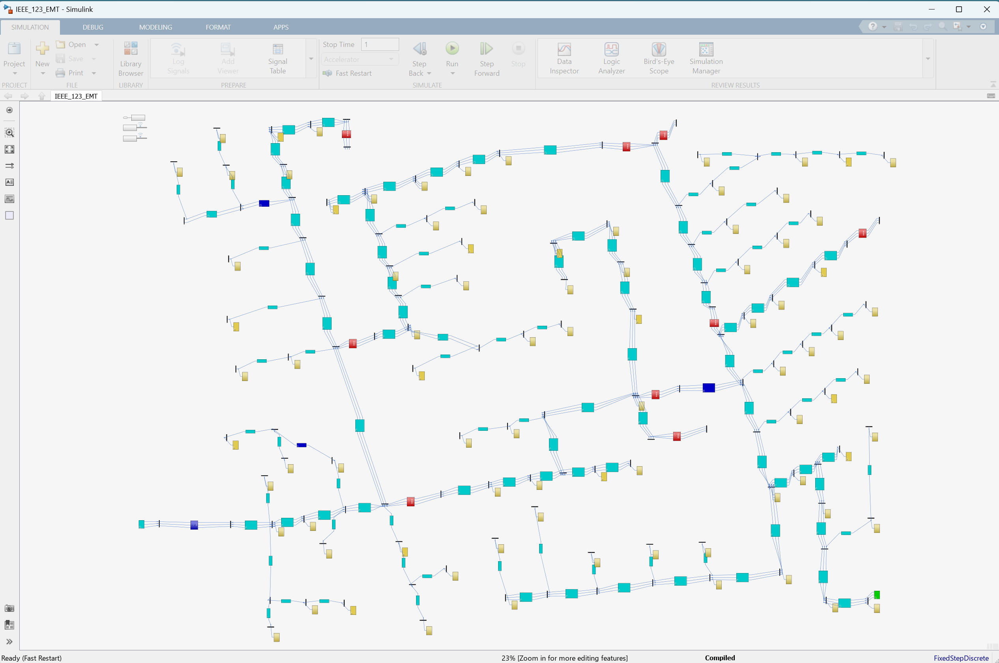
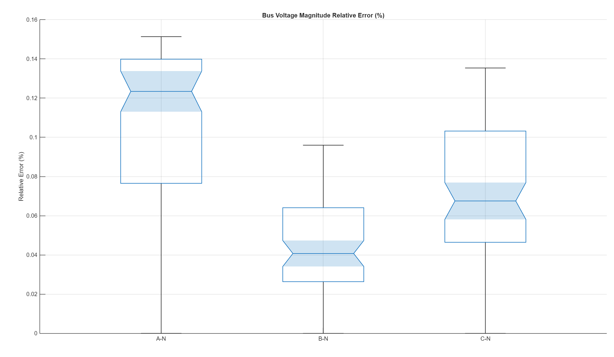

# Simscape&trade; Electrical&trade; - IEEE 123 Node Test Feeder EMT model 

Version 1.0.0

## Introduction

This project provides code and resources that programmatically builds an EMT model of the IEEE
123 Node Test Feeder. An image of the model is shown below.

Two workflows are provided. First a benchmark quasi-static EMT model is built and
the bus voltage magnitudes compared with the benchmark load-flow results.
The bus voltage magnitude relative errors are all more accurate than 0.16%, 
and are shown below. This model can also be used to change constant PQ and constant current
load setpoints as the simulation progresses.

Second, controllable faults are added to each node, resulting in 554 different fault sequences.
The faults are applied sequentially and classificationLearner in the Statistics and Machine Learning
Toolbox can be used to create a fault classification algorithm.

### Reference

W. H. Kersting, "Radial distribution test feeders," 2001 IEEE Power Engineering Society Winter Meeting.
Conference Proceedings (Cat. No.01CH37194), Columbus, OH, USA, 2001, pp. 908-912 vol.2,
doi: 10.1109/PESW.2001.916993

## Tool Requirements

Supported MATLAB Version:
R2025b and newer releases

Required:
* [MATLAB&reg;](https://www.mathworks.com/products/matlab.html)
* [Simulink&reg;](https://www.mathworks.com/products/simulink.html)
* [Simscape&trade;](https://www.mathworks.com/products/simscape.html)
* [Simscape&trade; Electrical&trade;](https://www.mathworks.com/products/simscape-electrical.html)
* [Statistics and Machine Learning Toolbox&trade;](https://www.mathworks.com/products/statistics.html)

## How to Use

You must first download the data for the IEEE 123 Node Test Feeder from the following link.

[IEEE PES Test Feeder](https://cmte.ieee.org/pes-testfeeders/resources)

Navigate to 1992 Test Feeder Cases and click on 123-bus Feeder to download 
a .zip file of the network data and benchmark results. Unzip the file in
the benchmark_data directory. This will add a directory called feeder123.

Open `IEEE_123_EMT.prj` in MATLAB. Once the project is installed, add the
feeder123 directory to the project path.

To build and run the benchmark model, navigate to the create_benchmark_model
directory and open and run create_IEEE_123_EMT.mlx. 

To build the model with faults, navigate to the create_fault_model directory
and open and run create_IEEE_123_EMT_faults.mlx.

To run the fault sequences and for further instruction on using classificationLearner,
open and run apply_faults_to_each_phase_multi.mlx.

## How to Use in MATLAB Online

You can try this in [MATLAB Online][url_online].
In MATLAB Online, from the **HOME** tab in the toolstrip,
select **Add-Ons** &gt; **Get Add-Ons**
to open the Add-On Explorer.
Then search for the submission name,
navigate to the submission page,
click **Add** button, and select **Save to MATLAB Drive**.

[url_online]: https://www.mathworks.com/products/matlab-online.html

## License

See [`LICENSE.txt`](LICENSE.txt).

_Copyright (C) 2026, The MathWorks, Inc._
